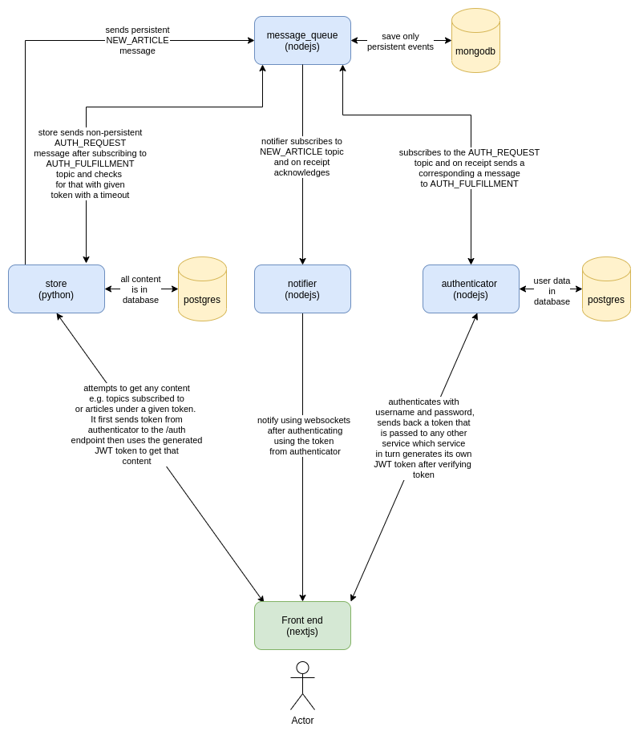

# article_curator

This is an application that curates articles links under particular topics such that any
user who has subscribed to that topic is alerted when any article is added to that topic.
**This application is under heavy development**

## Dependencies

- [Nodejs](https://nodejs.org/en/)
  - [Feathersjs](https://feathersjs.com/)
  - [ws](https://www.npmjs.com/package/ws)
- [MongoDB](https://www.mongodb.com/)
  - [Mongoose ORM](https://mongoosejs.com/docs/)
- [Postgres](https://www.postgresql.org/)
  - [SQLAlchemy](https://www.sqlalchemy.org/)
  - [Objectionjs](https://vincit.github.io/objection.js/)
- [gRPC](https://grpc.io/)
  - [protocol buffers 3](https://developers.google.com/protocol-buffers/docs/overview)
  - [Protobuf.js](https://www.npmjs.com/package/protobufjs)
  - [grpcio-tools](https://pypi.org/project/grpcio-tools/)
- [python](https://www.python.org/)
  - [fastapi](https://fastapi.tiangolo.com/)
- [nextjs](https://nextjs.org/)

## Design

It is composed of four back end services connected via grpc, and one front end service. One of those services acts like a message queue
to which all events from other services are sent, and persisted using mongodb, and when consumed
are deleted from the queue.

_The diagram below was drawn using [diagrams.net](https://diagrams.net). [Here](./.designs/article_curator.xml) is the original file_


### [front end](./front-end)

This is a [nextjs](https://nextjs.org/) app that is loaded in the browser by the user.
It includes the following main sections:

- Login
- Create account
- Logout
- Feed
  - Subscribe to topic
  - Article Feed
  - Create article
  - Create topic
  - New Article Alert

A few Notes:

- The new article alerts will be streamed via websockets from the [notifier back end service](./notifier). This is better than polling using REST API because then we don't need the notifier service to persist anything.
- The create account, login and logout actions will be done via REST API of the [authenticator back end service](./authenticator). These actions are not that frequent so a websocket would have been an overkill.
- The subscription to topic will be done via REST API of the [store back end service](./store). This action is not that frequent and so a websocket impliementation would be an overkill. Also whenever a user subscribes to a new topic, it sends a websocket message to the notifier service that it is interested in that topic also.
- The article feed will be received via websocket of the [store back end service](./store). New articles keep coming in as the user scrolls. To reduce the number of requests needed to be made to the server and thus also limit the number of database connections that have to be created on each request, the weboscket approach works best here.
- The creation of articles will be done via REST API of the [store back end service](./store). This is an infrequent action as most users will be expected to read more and create less. A REST API implementation suffices in this case.
- The creation of topics will be done via REST API of the [store back end service](./store). This is an infrequent action as most users will be expected to read more and create less. A REST API implementation suffices in this case.

### [authenticator](./authenticator)

This is a [feathersjs](https://feathersjs.com) that does only one thing i.e. handle authentication.
The authentication uses username and password.
On authentication, a JWT token is sent back to the client to use to authenticate with any other service.

The users are saved in a [postgreSQL](https://www.postgresql.org/) database.

#### Interface with [message queue service](./message-queue)

At the back, it interfaces with the [message queue service](./message-queue) via [gRPC](https://grpc.io/) inorder
to respond to any `AUTH_REQUEST` messages sent by other services that are pending fulfillment in the queue.

It subscribes to that topic `AUTH_REQUEST` topic by calling the `subscribeToTopic` method of message_queue and responds by sending a `AUTH_FULFILLMENT` message corresponding to the `AUTH_REQUEST` message by calling the `sendMessage`
method of the message_queue.

The `AUTH_REQUEST` message is of the form:

```JSON
{
  "token": "<token from client that got token from authenticator service>"
}
```

The `AUTH_FULFILLMENT` message is of the form:

```JSON
{
  "token": "<token from client that got token from authenticator service>",
  "user": {
    "_id": 234311891, // some big integer,
    "last_name": "<last name of user>",
    "first_name": "<first name of user>",
    "email": "<email address of the user>"
  } // or null
}
```

#### `/users`

Allowed methods: POST

A POST to the `/users` endpoint registers that user.
The payload is of the format:

```JSON
{
  "first_name": "John",
  "last_name": "Doe",
  "email": "johndoe@example.com",
  "password": "<John's password>"
}
```

#### `/authentication`

Allowed methods: POST

The POST payload to the `authentication` endpoint is in the format:

```JSON
{
  "strategy": "local",
  "email": "johndoe@example.com",
  "password": "<John's password>"
}
```

It returns the JWT token to be used to authenticate with other services.
It returns something like:

```JSON
{
  "accessToken": "<JWT for this user>",
  "authentication": {
    "strategy":"local"
  },
  "user":{
    "_id":"<user id>",
    "email":"johndoe@example.com"
  }
}
```

### [store](./store)

This is a [fastapi](https://fastapi.tiangolo.com/) python application that serves data via both
websockets and REST API. At the back, it interfaces with the [message queue service](./message-queue) via [gRPC](https://grpc.io/).

#### `/auth`

Allowed methods: POST

It subscribes to the `AUTH_FULFILLMENT` topic using the `sendMessage` method of [message queue service](./message-queue) and starts checking for a given token. It waits for a given timeout
before assuming that the auth request was not answered for whatever reason. It returns a timeout error to the client.

Immediately after subscribing to the `AUTH_FULFILLMENT` topic, it sends an `AUTH_REQUEST` message by calling the `sendMessage`to the [message queue service](./message-queue) service when a token is passed to the`/auth` endpoint.

When the right `AUTH_FULFILLMENT` message is recieved or the timeout is reached, the subscription is ended.

The POST payload to that endpoint is in the format:

```JSON
{
    "token": "<the token obtained from the authenticator service by the front end app>"
}
```

#### `/topics`

Allowed methods: POST, GET

The `/topics` endpoint returns the available topics as well allows creating new ones.
The `Topic` data looks like:

```JSON
{
  "_id": 234311891, // some big integer
  "name": "<the name of topic>"
}
```

#### `/articles`

Allowed methods: POST, PUT, GET, DELETE

The `/articles` endpoint returns the available articles as well as allowing creation, deletion and
updating of the same.

GET:
It is possible to filter the articles by topic using the `topic` query parameter.
It is also possible to filter the articles by author using the `author` query parameter.

POST:
On creation of the article, the 'author' database table is upserted with the new details of the current user as author of the article and that author is linked to the article record.

Also on creation the 'topic' database table is upserted with the topic details
and that topic is linked to the article record.

Also on creation, a `NEW_ARTICLE` message is sent to the [message_queue](/message_queue) under that topic of `NEW_ARTICLE`.

The `NEW_ARTICLE` message is of the form:

```JSON
{
  "article_id": 23267834,
  "article_title": "<the article title>"
}
```

UPDATE:
On update of the article, the 'topic' database table is upserted with the topic details
and that topic is linked to the article record.

The `Article` data looks like:

```JSON
{
  "_id": 234311891, // some big integer
  "title": "<title of the article>",
  "description": "<the short description of the article>",
  "url": "<the url of the article>",
  "topic": {
    "_id": 234311891, // some big integer,
    "name": "<the name of topic>"
  },
  "author": {
    "_id": 234311891, // some big integer,
    "last_name": "<last name of the user>",
    "first_name": "<first name of the user>"
  }
}
```

#### `/authors`

Allowed methods: GET

The `/authors` endpoint allows one to view all possible authors.

The `Author` data looks like:

```JSON
{
  "_id": 234311891, // some big integer
  "first_name": "<first name of the author>",
  "last_name": "<last name of the author>"
}
```

Do note that author database table also has email in it

### [./notifier](.notifier)

_In future, we could persist the notifications and even send them via email but for now, they are realtime notifications_
This is a [ws](https://www.npmjs.com/package/ws) websocket nodjes application that listens (subscribes)
to the `NEW_ARTICLE` topic of the [message queue service](./message-queue) via [gRPC](https://grpc.io/) and then
sends notifications to the client that have subscribed to a given topic.

On connection, a UUID is created for that connection. It is the one used to track the authentication state and
the topics subscribed to. This is got from [this Stckoverflow answer](https://stackoverflow.com/questions/62370962/how-to-create-join-chat-room-using-ws-websocket-package-in-node-js#answer-62867363)

#### authentication

The client on connection, sends its token from the [authenticator service](./authenticator) as a way to create
an `AUTH_REQUEST` message that is to be sent to the [message_queue service](./message_queue).
Before the `AUTH_REQUEST` is sent to the message_queue, a new subscription to the topic `AUTH_FULFILLMENT` is created for that connection with a check for the given token and a timeout.

When the right `AUTH_FULFILLMENT` message is recieved or the timeout is reached, the subscription is ended.
If the user in the `AUTH_FULFILLMENT` message is null, the connection is killed with error message of unauthorized. If a timeout is reached instead, a Timeout error is sent to the client and the connection broken.

The connection's uuid is added to the global object of authenticated clients.
On disconnection, that uuid is removed from the global object of the authenticated clients.

The global object of authenticated_clients is of the form:

```Javascript
authenticated_clients = {
  "uoyore784837987": clientObject1,
  "suiy98305": clientObject2,
  ....
}
```

#### subscription to topics

After the client is authenticated, it sends a message of the list of topics they are interested in.
The on_message callback of the notifier service has a way of adding the given connection's UUID to the object of
clients under the given topic on a global object that has objects of available topics.

Also whenever a user subscribes to a new topic, it sends a message to notifier that it is interested in that
topic also. The notifier adds that client to the object of clients under that topic in the global register of
topics and their clients

When a client disconnects, its UUID is removed from all topics objects.

The global register of topics is of the form:

```Javascript
const topics = {
  topic_1_name: {
    "hjfdyryqoyryoUIID": clientObject1,
     "hjfdyr674hgkqyqoyryoUIID": clientObject2,
     ...
  },
  topic_2_name: {
    "ddsu89734": clientObject3,
     "hjfdyr674hgkqyqoyryoUIID": clientObject2,
     ...
  },
  ...
}
```

The notifier is connected to the `NEW_ARTICLE` topic of the [message_queue service](/message_queue). In this topic, the message_queue queries the mongodb for all new_article records and sends them back one by one.

In the call back for the resulting stream, it loops through the clients under the topic of the new article received, and sends them the alert of the new article.
For each `NEW_ARTICLE` message, it sends an acknowledgement message to the message_queue service alerting it that it has alerted the clients. The message queue in turn deletes the new_article record in the mongodb database.

The `NEW_ARTICLE` message sent via the stream comes with the id of the artice in the mongodb. It is of the form:

```JSON
{
  "id": "ryeyuiy278164yqgiyuq", // some UUID managed by mongodb
  "data": { "id": 23267834,
            "title": "<the article title>"
            }
}
```

The `ACKNOWLEDGEMENT` message is of the form:

```JSON
{
  "type": "ACKNOWLEDGEMENT",
  "payload": "ryeyuiy278164yqgiyuq"
}
```

### [message_queue](./message_queue)

This is message queue service that has two methods and a mongodb for persistence of messages. It is built on [nodejs](https://nodejs.org/en/).

The methods are via [gRPC](https://grpc.io/). They include:

#### sendMessage

This method allows other apps to send JSON (any string is possible but a proper JSON is recommended) strings
in a unary (request-response) communication method.

The sendMessage method is of the form:

```protobuf
service messageQueue{
  ...
  rpc sendMessage(ClientMessage) returns (ServerAcknowledgement)
}
```

The `ClientMessage` gRPC message is of the form:

```protobuf
message ClientMessage {
  string topic = 1;
  string data = 2;
}
```

The `ServerAcknowledgement` gRPC message is of the form:

```protobuf
message ServerAcknowledgement {
  bool received = 1;
}
```

#### subscribeToTopic

The `subscribeToTopic` method allows other apps to connect to the message_queue service via a bidirectional stream
and receive new messages, one after the other. The client apps should in turn can send back `ACKNOWLEDGMENT` messages
or else the same message will be sent over and over again.

It is of the form:

```protobuf
service messageQueue{
  ...
  rpc susbcribeToTopic(stream ClientResponse) returns (stream ServerMessage)
}
```

The `Topic` gRPC message is of the form:

```protobuf
message ClientResponse {
    string type = 1;
    string payload = 2;
}
```

The `ServerMessage` gRPC message is of the form:

```protobuf
message ServerMessage {
  string id = 1;
  string data = 2;
}
```
