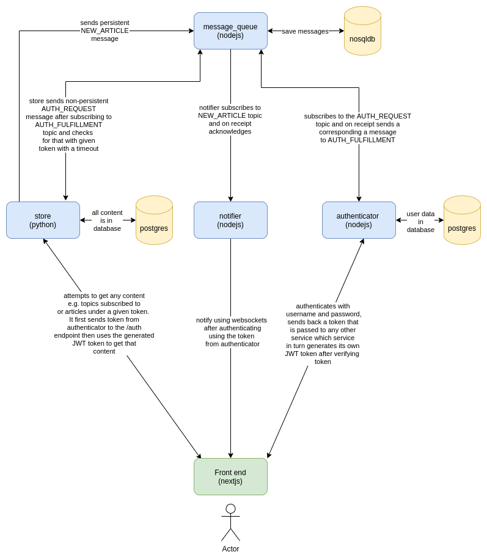

# article_curator

This is an application that curates articles links under particular topics such that any
user who has subscribed to that topic is alerted when any article is added to that topic.
**This application is under heavy development**

## Dependencies

- [Nodejs](https://nodejs.org/en/)
  - [Feathersjs](https://feathersjs.com/)
- [MongoDB](https://www.mongodb.com/)
  - [Mongoose ORM](https://mongoosejs.com/docs/)
- [Postgres](https://www.postgresql.org/)
  - [SQLAlchemy](https://www.sqlalchemy.org/)
  - [Objectionjs](https://vincit.github.io/objection.js/)
- [gRPC](https://grpc.io/)
  - [protocol buffers 3](https://developers.google.com/protocol-buffers/docs/overview)
  - [Protobuf.js](https://www.npmjs.com/package/protobufjs)
  - [grpcio-tools](https://pypi.org/project/grpcio-tools/)
- [python](https://www.python.org/)
  - [fastapi](https://fastapi.tiangolo.com/)
- [nextjs](https://nextjs.org/)

## Design

It is composed of four back end services connected via grpc, and one front end service. One of those services acts like a message queue
to which all events from other services are sent, and persisted using mongodb, and when consumed
are deleted from the queue.

_The diagram below was drawn using [diagrams.net](https://diagrams.net). [Here](./.designs/article_curator.xml) is the original file_


### [front end](./front-end)

This is a [nextjs](https://nextjs.org/) app that is loaded in the browser by the user.
It includes the following main sections:

- Login
- Create account
- Logout
- Feed
  - Subscribe to topic
  - Article Feed
  - Create article
  - Create topic
  - New Article Alert

A few Notes:

- The new article alerts will be streamed via websockets from the [notifier back end service](./notifier). This is better than polling using REST API because then we don't need the notifier service to persist anything.
- The create account, login and logout actions will be done via REST API of the [authenticator back end service](./authenticator). These actions are not that frequent so a websocket would have been an overkill.
- The subscription to topic will be done via REST API of the [store back end service](./store). This action is not that frequent and so a websocket impliementation would be an overkill.
- The article feed will be received via websocket of the [store back end service](./store). New articles keep coming in as the user scrolls. To reduce the number of requests needed to be made to the server and thus also limit the number of database connections that have to be created on each request, the weboscket approach works best here.
- The creation of articles will be done via REST API of the [store back end service](./store). This is an infrequent action as most users will be expected to read more and create less. A REST API implementation suffices in this case.
- The creation of topics will be done via REST API of the [store back end service](./store). This is an infrequent action as most users will be expected to read more and create less. A REST API implementation suffices in this case.

### [authenticator](./authenticator)

This is a [feathersjs](https://feathersjs.com) that does only one thing i.e. handle authentication.
The authentication uses username and password.
On authentication, a JWT token is sent back to the client to use to authenticate with any other service.

The users are saved in a [postgreSQL](https://www.postgresql.org/) database.

#### Interface with [message queue service](./message-queue)

At the back, it interfaces with the [message queue service](./message-queue) via [gRPC](https://grpc.io/) inorder
to respond to any `AuthRequest` events sent by other services that are pending fulfillment in the queue.

It listens to a bidirectional stream from the [message queue service](./message-queue), receiving `AuthRequest` objects and responding by calling a method `fulfillAuthRequest` on the [message queue service](./message-queue).

The `AuthRequest` type is of the form:

```protobuf
message AuthRequest {
    string token = 1;
}
```

The `fulfillAuthRequest` method is of the form:

```protobuf
rpc fulfillAuthRequest(AuthRequest) returns (AuthFulfillment);
```

where `AuthFulfillment` is of the form:

```protobuf
message AuthFulfillment {
    bool isValid = 1;
}
```

#### `/users`

A POST to the `/users` endpoint registers that user.
The payload is of the format:

```JSON
{
  "email": "johndoe@example.com",
  "password": "<John's password>"
}
```

**The GET method is disabled.**

#### `/authentication`

The POST payload to the `authentication` endpoint is in the format:

```JSON
{
  "strategy": "local",
  "email": "johndoe@example.com",
  "password": "<John's password>"
}
```

It returns the JWT token to be used to authenticate with other services.
It returns something like:

```JSON
{
  "accessToken": "<JWT for this user>",
  "authentication": {
    "strategy":"local"
  },
  "user":{
    "_id":"<user id>",
    "email":"johndoe@example.com"
  }
}
```

### [store](./store)

This is a [fastapi](https://fastapi.tiangolo.com/) python application that handles serves data via both
websockets and REST API. At the back, it interfaces with the [message queue service](./message-queue) via [gRPC](https://grpc.io/).

#### `/auth`

It sends `AuthRequest` events to the [message queue service](./message-queue) service when a token is passed to the `/auth` endpoint.

The POST payload to that endpoint is in the format:

```JSON
{
    "token": "<the token obtained from the authenticator service by the front end app>"
}
```
